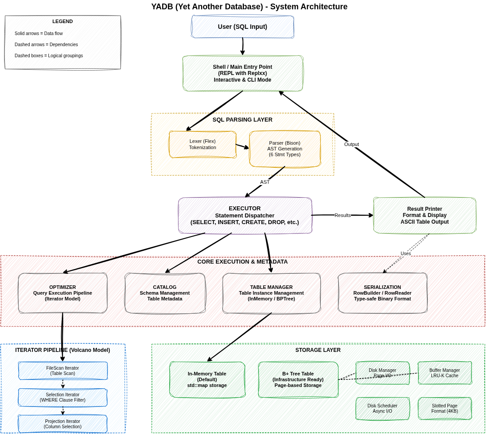

MiniDB is a SQL database written in modern C++, built from scratch as an
educational project. MiniDB is focused on being simple, functional, and correct. As a result,
performance and scalability are intentionally *not* the top priorities—clarity
and educational value come first.

---

## Contents

- [Building](#building)
- [Usage](#usage)
- [Architecture](#architecture)
- [Supported SQL Syntax](#supported-sql-syntax)
- [Roadmap](#roadmap)

---

## Building

1. Clone the repository and submodules:
```bash
git clone --recursive https://github.com/ArnavHarshit/MiniDB.git
```

2. Build using CMake:
```bash
cd minidb
mkdir build
cd build
cmake ..
cmake --build .
```

---

## Usage

After building, you can run the MiniDB shell:

```bash
# From the build/ directory
./src/shell/minidb-shell
```

### Demo

Here's a quick demo of what MiniDB can currently do:

```sql
-- Create a table
CREATE TABLE users (name TEXT, age INTEGER);

-- Insert some data
INSERT INTO users VALUES (Alice, 30);
INSERT INTO users VALUES (Bob, 25);
INSERT INTO users VALUES (Charlie, 35);

-- Query the data
SELECT * FROM users;
```

**Output:**
```
┌─────────┬─────┐
│ name    │ age │
├─────────┼─────┤
│ Alice   │ 30  │
│ Bob     │ 25  │
│ Charlie │ 35  │
└─────────┴─────┘
3 rows in set
```

You can also select specific columns:

```sql
SELECT name FROM users;
```

### Running Tests

Tests can be built and run for individual components:

```bash
# From the build/ directory
cmake --build . --target test
```

---

## Architecture



MiniDB is organized into distinct layers handling parsing, query execution, storage, and result formatting. The diagram above shows the high-level architecture and relationships between major components:

- **SQL Parsing Layer**: Lexer and Parser (Flex/Bison) tokenize and parse SQL into an AST
- **Executor**: Dispatches SQL statements to appropriate handlers
- **Core Components**: Optimizer (iterator pipeline), Catalog (schema management), Table Manager, and Serialization
- **Iterator Pipeline**: Volcano-style query execution with FileScan, Selection, and Projection iterators
- **Storage Layer**: In-memory tables (default) and B+ tree infrastructure with disk management, buffering, and slotted page format

> **Note:** For more detailed information about specific components, check the README files in the respective subdirectories (e.g., `src/optimizer/README.md`).

---

## Supported SQL Syntax

MiniDB currently supports a subset of SQL. Here's what you can use:

### CREATE TABLE

```sql
CREATE TABLE table_name (
    column1 TYPE,
    column2 TYPE,
    ...
);
```

**Supported Types:**
- `INTEGER` - 32-bit signed integer
- `TEXT` - Variable-length string

**Example:**
```sql
CREATE TABLE users (name TEXT, age INTEGER);
```

### INSERT

```sql
INSERT INTO table_name VALUES (value1, value2, ...);
```

**Notes:**
- Values must match the column order and types from the table definition
- TEXT values do not require quotes

**Example:**
```sql
INSERT INTO users VALUES (Alice, 30);
```

### SELECT

```sql
SELECT column1, column2, ... FROM table_name [WHERE condition];
SELECT * FROM table_name [WHERE condition];
```

**Supported WHERE operators:**
- `=` - Equality
- `!=` - Inequality
- `<` - Less than
- `>` - Greater than
- `<=` - Less than or equal
- `>=` - Greater than or equal

**Examples:**
```sql
SELECT * FROM users;
SELECT name FROM users;
SELECT name, age FROM users WHERE age > 25;
SELECT * FROM users WHERE name = Alice;
```

---

## Roadmap

- ✅ Implement disk manager
- ✅ Implement disk scheduler
- ✅ Implement page buffer
- ✅ Implement slotted page interface
- ✅ Implement lexer and parser for SQL subset
- ✅ Implement shell interface
- ✅ Implement basic executor with type-safe operations
- ✅ Implement result printer with formatted table output
- ⬜ Implement optimizer
  - ✅ Basic iterator-based query execution (Volcano model)
  - ✅ FileScanIterator and ProjectionIterator
  - ✅ SelectionIterator (WHERE clause filtering)
  - ⬜ JoinIterator
  - ⬜ Implement external sorting
  - ⬜ Cost-based optimization
- ⬜ Implement B+ tree storage engine
- ⬜ Add transaction support
- ⬜ Add concurrency control

